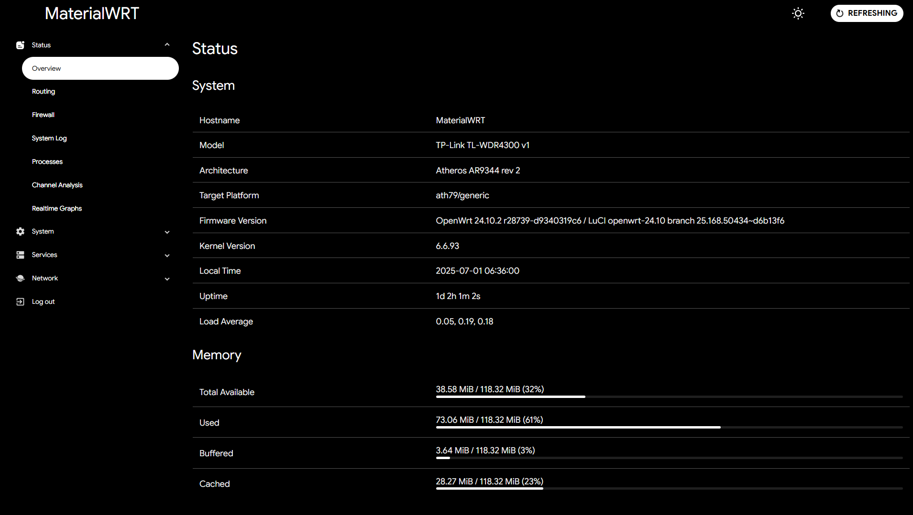

# MaterialWRT
An improved Material Design 3 theme for OpenWRT's LuCI! (With plans to potentially update to MD3 Expressive soon!)

## ✨ Theme Preview
<table>
  <tr>
    <th>🖥️ Desktop</th>
    <th>📱 Mobile</th>
  </tr>
  <tr>
    <td></td>
    <td></td>
  </tr>
</table>

### 🎨 Color Schemes
<table>
  <tr>
    <td></td>
    <td></td>
    <td></td>
    <td></td>
    <td></td>
    <td></td>
    <td></td>
    <td></td>
  </tr>
</table>

## ✅ What's done?
- [X] Dark Themes
- [X] Fix style issues
- [X] Improve to be closer to MD3 principles
- [X] Cleaned up CSS of comments
- [X] AMOLED color scheme support with experimental fade animations (dark mode only, for now)

## 📝 To-do
- [ ] Update to Material 3 Expressive design language
- [ ] Add more color schemes
- [ ] Fix AMOLED theme light/dark mode

## 📋 Credits
- [AngelaCooljx - and all other credits under their original repository](https://github.com/AngelaCooljx/luci-theme-material3)
- [shiyu1314 - for the base codebase](https://github.com/shiyu1314/luci-theme-material3)